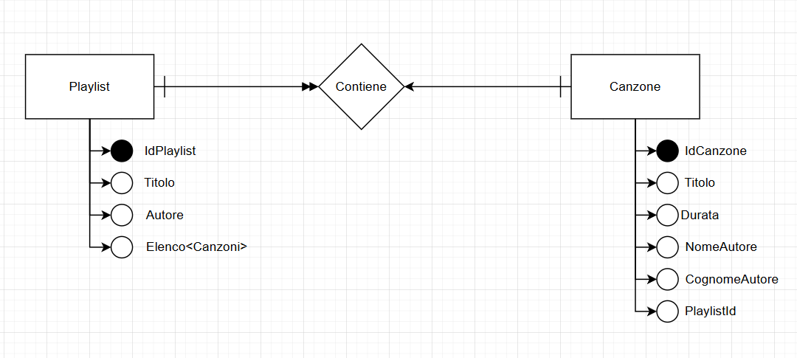

# Progetto: Minimal API gestione delle playlist.

## Indice
- [1. Diagrama UML](#1-diagramma-uml)
- [2. Le due Classi](#2-le-due-classi)
- [3. Le principali operazioni CRUD](#3-le-principali-operazioni-crud)
- [4. Due tecnologie](#4-due-tecnologie)
  - [4.1. *DATABASE*](#41-database)
  - [4.2. *OPENAPI*](#42-openapi)
- [5. Le risposte alle chiamate](#5-le-risposte-alle-chiamate)

## 1. Diagramma UML


## 2. Le due Classi
Questo progetto, come richiesto da consegna, nasce con la creazione di:
- ***PLAYLIST***, con i seguenti attiributi:
```csharp
        [Key]
            // "[Key]" Serve per far capire al db che IdPlaylist è chiave primaria
        public int IdPlaylist { get; set; }
        public string? Titolo { get; set; }
        public string Autore { get; set; } = "Utente";
            // Campo che se non viene compilato avrà "Utente"

        public List<Canzone>? Elenco { get; set; } = new();
            // "= new()" serve per inizializzare automaticamente l'elenco, con una nuova lista vuota al momento della creazione dell’oggetto.
```

- ***CANZONE***, con i seguenti attiributi:
```csharp
        [Key]
            // "[Key]" Serve per far capire al db che IdCanzone è chiave primaria
        public int IdCanzone { get; set; }
        public string Titolo { get; set; } = null!;
            // Campo sarà nullo prima della prima compilazione, e subito dopo non potrà essere nullo 
        public int Durata { get; set; }
        public string NomeAutore { get; set; } = "Non riconosciuto";
            // Campo che se non viene compilato avrà "Non riconosciuto"
        public string CognomeAutore { get; set; } = "";
            // Campo che se non viene compilato sarà vuoto 
        public int? PlaylistId { get; set; }
            // Campo che funge da chiave secondaria.
        
```
## 3. Le principali operazioni CRUD

In seguito il progetto continua con l'implementazione, per ogni classe, delle operazioni CRUD.
- **GET - Read**: 
    - Get tutte le Playlist, con annesse le canzoni inserite negli elenchi;
    - Get tutte le Canzoni;
- **POST - Create**:
    - Post di una Playlist, con (nel caso si voglia) annesse canzoni nell'elenco;
    - Post di una Canzone, con (nel caso si voglia) possibilità di inserirla in una playlisy inserendo l'`id` della playlist nella campo `PlaylistId`;
- **DELETE - Delete**: (Tramite ID)
    - Delete di una playlist, lasciando però tutte le canzoni inserite (così possiamo riassegnarle ad altre playlist senza doverle reiserire);
    - Delete di una canzone;
- **PUT - Update**: (Tramite ID)
    - Put di una playlist, andando ad aggiornare le variabili della playlist e le canzoni al suo interno;
    - Put di una canzone, andando a cambiare i valori di una canzone.

- **GET FILTRO - Read**: (Tramite ID)
    - Get di una Playlist specificata dall'`id`, con annesse le canzoni inserite nel suo elenco;
    - Get di una Canzone specificata dall'`id`;

In un vecchio commit si può vedere che ho applicato i `DTO`, così da andare a nascondere gli `id` ogni qual volta andiamo ad osservare i dati che ci arrivano dal `DB` (Get, Post, Put). 

Solo che adesso(Sesto Commit), dato che gran parte degli end point lavorano per ID ho preferito togliere i DTO così da per poter lavorare in modo più chiaro e meno incasinato (altrimenti dovevo andare a tentativi sugli ID).

## 4. Due tecnologie

Inoltre ho utilizzato 2 tecnologie: 
### 4.1. *DATABASE*

    Ho usato il db sqlite, con il controllo dei dati gestito da EF (Entity Framework).
```csharp
    builder.Services.AddDbContext<LibreriaContext>(
        options => options.UseSqlite("Data Source=Libreria.db")
    );
    // Abbiamo configurato l'EF con il database sqlite "Libreria.db"
    builder.Services.AddCors();
    // Per permettere le richieste anche se dallo stesso dispositivo
```

```csharp
    using (var scope = app.Services.CreateScope())
    {
        var db = scope.ServiceProvider.GetRequiredService<LibreriaContext>();
        // Recupera il context 
        db.Database.EnsureCreated();
        // Controlla se il DB e le tabelle esistono; se non ci sono li crea.
    }
```
Nelle operazioni CRUD: 
```csharp
    // Per esempio una get

    app.MapGet("/api/read/songs", async (LibreriaContext db) =>
    // Passiamo il contesto e poi EF gestirà la comunicazione con il db.
    {
        var elenco = await db.Canzoni.ToListAsync();

        var result = elenco.Select(c => new
        {
            Titolo = c.Titolo,
            Durata = c.Durata,
            Nome = c.NomeAutore,
            Cognome = c.CognomeAutore
        });
        // Noi lavoreremo solo con gli oggetti.
        
        return Results.Ok(result);
    })
    .WithOpenApi();

    // L'operazione deve essere Awayt-Async dato che ci devono arrivare le conferme o gli errori dal DB prima di poter dare delle risposte all'utente.
```

### 4.2. *OPENAPI* 
    Ho implementato questo pacchetto che mi ha permesso di lavorare anche senza postman.

```csharp 
    // Aggiungiamo i servizi per Swagger/OpenAPI
    builder.Services.AddEndpointsApiExplorer();
    builder.Services.AddSwaggerGen();
```
```csharp 
    // Controlliamo se siamo in modalità sviluppo
    if (app.Environment.IsDevelopment())
    {
        // Se si attiviamo Swagger e SwaggerUI (Interfaccia grafica)
        app.UseSwagger();
        app.UseSwaggerUI();
    }
```
---
## 5. Le risposte alle chiamate

- `POST` di una Playlist (`/api/create/playlist`): 
```JSON
// BODY di richiesta:
{
  "titolo": "FOGGIA",
  "autore": "Tony Mezzagamba",
  "elenco": [
    {
      "durata": 226,
      "titolo": "Breezeblocks",
      "nomeAutore": "alt-j",
      "playlistId": 1
    },
    {
      "durata": 112,
      "titolo": "Please, Please, Please, Let Me Get What I Want - 2001 Remastered",
      "nomeAutore": "The Smiths",
      "playlistId": 1
    },
    {
      "durata": 245,
      "titolo": "There Is a Light That Never Goes Out - 2011 Remastered",
      "nomeAutore": "The Smiths",
      "playlistId": 1
    }
  ]
}

// Risposta: Status 201
{
  "idPlaylist": 1,
  "titolo": "FOGGIA",
  "autore": "Tony Mezzagamba",
  "elenco": [
    {
      "idCanzone": 1,
      "durata": 226,
      "titolo": "Breezeblocks",
      "nomeAutore": "alt-j",
      "cognomeAutore": "",
      "playlistId": 1
    },
    {
      "idCanzone": 2,
      "durata": 112,
      "titolo": "Please, Please, Please, Let Me Get What I Want - 2001 Remastered",
      "nomeAutore": "The Smiths",
      "cognomeAutore": "",
      "playlistId": 1
    },
    {
      "idCanzone": 3,
      "durata": 245,
      "titolo": "There Is a Light That Never Goes Out - 2011 Remastered",
      "nomeAutore": "The Smiths",
      "cognomeAutore": "",
      "playlistId": 1
    }
  ]
}
```

- `POST` di una Canzone (`/api/create/song`): 
```JSON
// BODY di richiesta:
{
  "durata": 247,
  "titolo": "Cinque Giorni",
  "nomeAutore": "Michele",
  "cognomeAutore": "Zarrillo",
  "playlistId": 1
}

// Risposta: Status 201
{
  "idCanzone": 4,
  "durata": 247,
  "titolo": "Cinque Giorni",
  "nomeAutore": "Michele",
  "cognomeAutore": "Zarrillo",
  "playlistId": 1
}
```
---
---
---

- `GET` di tutte le Playlisy (`/api/read/playlist`): 
```JSON
// Risposta: Status 200
[
  {
    "idPlaylist": 1,
    "titolo": "FOGGIA",
    "autore": "Tony Mezzagamba",
    "elenco": [
      {
        "idCanzone": 1,
        "durata": 226,
        "titolo": "Breezeblocks",
        "nomeAutore": "alt-j",
        "cognomeAutore": "",
        "playlistId": 1
      },
      {
        "idCanzone": 2,
        "durata": 112,
        "titolo": "Please, Please, Please, Let Me Get What I Want - 2001 Remastered",
        "nomeAutore": "The Smiths",
        "cognomeAutore": "",
        "playlistId": 1
      },
      {
        "idCanzone": 3,
        "durata": 245,
        "titolo": "There Is a Light That Never Goes Out - 2011 Remastered",
        "nomeAutore": "The Smiths",
        "cognomeAutore": "",
        "playlistId": 1
      },
      {
        "idCanzone": 4,
        "durata": 247,
        "titolo": "Cinque Giorni",
        "nomeAutore": "Michele",
        "cognomeAutore": "Zarrillo",
        "playlistId": 1
      }
    ]
  },
  {
    "idPlaylist": 2,
    "titolo": "BAD Feeling",
    "autore": "Luca Andreozzi",
    "elenco": [
      {
        "idCanzone": 5,
        "durata": 120,
        "titolo": "La rosa e la penna",
        "nomeAutore": "Non riconosciuto",
        "cognomeAutore": "",
        "playlistId": 2
      }
    ]
  }
]
```
- `GET` di tutte le Canzoni (`/api/read/songs`): 
```JSON
// Risposta: Status 200
[
  {
    "idCanzone": 1,
    "durata": 226,
    "titolo": "Breezeblocks",
    "nomeAutore": "alt-j",
    "cognomeAutore": "",
    "playlistId": 1
  },
  {
    "idCanzone": 2,
    "durata": 112,
    "titolo": "Please, Please, Please, Let Me Get What I Want - 2001 Remastered",
    "nomeAutore": "The Smiths",
    "cognomeAutore": "",
    "playlistId": 1
  },
  {
    "idCanzone": 3,
    "durata": 245,
    "titolo": "There Is a Light That Never Goes Out - 2011 Remastered",
    "nomeAutore": "The Smiths",
    "cognomeAutore": "",
    "playlistId": 1
  },
  {
    "idCanzone": 4,
    "durata": 247,
    "titolo": "Cinque Giorni",
    "nomeAutore": "Michele",
    "cognomeAutore": "Zarrillo",
    "playlistId": 1
  },
  {
    "idCanzone": 5,
    "durata": 120,
    "titolo": "La rosa e la penna",
    "nomeAutore": "Non riconosciuto",
    "cognomeAutore": "",
    "playlistId": 2
  }
]
```

---
---
---

- `GET` di una Playlist specifica (`/api/read/playlist/2`): 
```JSON
// Risposta: Status 200
{
  "idPlaylist": 2,
  "titolo": "BAD Feeling",
  "autore": "Luca Andreozzi",
  "elenco": [
    {
      "idCanzone": 5,
      "durata": 120,
      "titolo": "La rosa e la penna",
      "nomeAutore": "Non riconosciuto",
      "cognomeAutore": "",
      "playlistId": 2
    }
  ]
}
```

- `GET` di una Canzone specifica (`/api/read/song/2`): 
```JSON
// Risposta: Status 200
{
  "idCanzone": 3,
  "durata": 245,
  "titolo": "There Is a Light That Never Goes Out - 2011 Remastered",
  "nomeAutore": "The Smiths",
  "cognomeAutore": "",
  "playlistId": 1
}
```
---
---
---

- `PUT` di una Playlist (`/api/update/playlist/2`): 
```JSON
// Prima della modifica
{
  "idPlaylist": 2,
  "titolo": "BAD Feeling",
  "autore": "Luca Andreozzi",
  "elenco": [
    {
      "idCanzone": 4,
      "durata": 247,
      "titolo": "Cinque Giorni",
      "nomeAutore": "Michele",
      "cognomeAutore": "Zarrillo",
      "playlistId": 2
    }
  ]
}

// BODY di richiesta:
{
  "titolo": "Colonna sonora di Foggia",
  "autore": "Roberto Capone",
  "elenco": [
    {"idCanzone": 4},
    {"idCanzone": 5}
  ]
}

// Risposta: Status 200
{
  "idPlaylist": 2,
  "titolo": "Colonna sonora di Foggia",
  "autore": "Roberto Capone",
  "elenco": [
    {
      "idCanzone": 4,
      "durata": 247,
      "titolo": "Cinque Giorni",
      "nomeAutore": "Michele",
      "cognomeAutore": "Zarrillo",
      "playlistId": 2
    },
    {
      "idCanzone": 5,
      "durata": 226,
      "titolo": "Del Verde",
      "nomeAutore": "Calcutta",
      "cognomeAutore": "",
      "playlistId": 2
    }
  ]
}
```

- `POST` di una Canzone (`/api/create/song/5`): 
```JSON
// Prima della modifica
{
    "idCanzone": 5,
    "durata": 120,
    "titolo": "La rosa e la penna",
    "nomeAutore": "Non riconosciuto",
    "cognomeAutore": "",
    "playlistId": 2
}
// BODY di richiesta:
{
    "idCanzone": 5,
    "durata": 226,
    "titolo": "Del Verde",
    "nomeAutore": "Calcutta",
    "cognomeAutore": "",
    "playlistId": 2
}

// Risposta: Status 200
{
  "idCanzone": 5,
  "durata": 226,
  "titolo": "Del Verde",
  "nomeAutore": "Calcutta",
  "cognomeAutore": "",
  "playlistId": 2
}
```
---
---
---
- `DELETE` di una Playlist (`/api/delete/playlist/2`): 
```JSON
"Playlist cancellata con successo."
// Ma non cancella le canzoni, le dissocia dalla playlist ma le tiene nel db
```

- `DELETE` di una Canzone (`/api/delete/song/5`): 
```JSON
"Canzone cancellata con successo."
```
